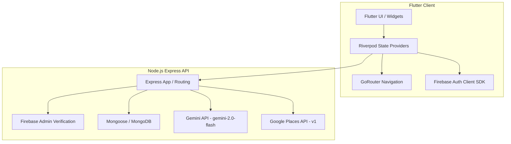

# Raha

Raha (meaning *comfort* or *peace* in Arabic) is a modern MVP designed for UAE expats. The platform helps users discover authentic home cuisines, book trusted home services, and receive personalized local recommendations powered by AI.

Built as a hybrid ecosystem, it comprises a **Flutter mobile application** and a **Node.js/Express REST API** integrated with MongoDB, Firebase Authentication, Google Places API, and the Gemini API.

---

## 🏗️ Project Architecture



### Tech Stack
* **Frontend**: Flutter, Dart, Riverpod (state management), GoRouter (routing), Firebase Auth client.
* **Backend**: Node.js, Express, MongoDB (Mongoose), Firebase Admin SDK.
* **APIs & Integrations**:
  * **Gemini API (`gemini-2.0-flash`)**: Generates custom onboarding tips, dining, and service recommendations based on user demographics (nationality, city, interests).
  * **Google Places API (New v1)**: Enriches local food spots with real-world Google metadata (website, opening hours, photos, ratings).

---

## 📂 Directory Structure

```txt
├── backend/                  # Node.js + Express API
│   ├── src/
│   │   ├── controllers/      # Route controllers (Auth, Booking, Food, Recommendation)
│   │   ├── middleware/       # Token verification, rate limiting, and errors
│   │   ├── models/           # Mongoose schemas (User, Booking, FoodSpot, ServiceProvider)
│   │   ├── routes/           # REST endpoints
│   │   ├── scripts/          # Database seeding and migration helper scripts
│   │   └── utils/            # Gemini, Places, and Firebase initialization clients
│   └── app.js                # App entrypoint
│
└── frontend/                 # Flutter Mobile App
    ├── lib/
    │   ├── core/             # Routing (GoRouter), Theme, and Config rules
    │   ├── data/             # Models, services (API, Cache), and Repositories
    │   ├── features/         # Feature modules (Auth, Home, Onboarding, Food, Services, Profile)
    │   └── shared/           # Reusable widgets and UI helpers
    └── pubspec.yaml          # Flutter dependencies
```

---

## ⚙️ Setup & Installation

### 1. Backend Setup

Navigate to the `backend/` directory:
```sh
cd backend
npm install
```

#### Environment Variables (`backend/.env`)
Create a `.env` file in the `backend/` directory based on `.env.example`:
```env
MONGO_URI=mongodb://localhost:27017/raha
FIREBASE_PROJECT_ID=your-firebase-project-id
GEMINI_API_KEY=your-gemini-api-key
GOOGLE_PLACES_API_KEY=your-google-places-key (optional)
PORT=5000
ALLOWED_ORIGINS=http://localhost:3000,http://10.0.2.2:5000
RATE_LIMIT_WINDOW_MS=900000
RATE_LIMIT_MAX=100
```

#### Firebase Service Account Configuration
To enable authentication validation, place your Firebase admin credentials inside the backend directory:
* Save your Firebase admin service key file as `backend/serviceAccountKey.json`.
* Or configure `GOOGLE_APPLICATION_CREDENTIALS` environment variable to point to the key.

#### Run Verification & Database Seeding
Verify that backend connections and variables are working, then seed the database with initial spots and service providers:
```sh
# Verify configuration
npm run verify

# Seed local database data
npm run seed
```

#### Start the Server
```sh
npm start
```

---

### 2. Frontend Setup

Navigate to the `frontend/` directory:
```sh
cd frontend
flutter pub get
```

#### Firebase Client Config Files
Make sure to add your client configuration files under the respective platform directories:
* **Android**: [frontend/android/app/google-services.json](file:///Users/rizwan/Documents/GitHub/Raha/frontend/android/app/google-services.json)
* **iOS**: [frontend/ios/Runner/GoogleService-Info.plist](file:///Users/rizwan/Documents/GitHub/Raha/frontend/ios/Runner/GoogleService-Info.plist)

#### Run the Flutter App
Run the app targeting the emulator or local device. Specify your local backend API host address (use `http://10.0.2.2:5000` for Android Emulator):
```sh
flutter run --dart-define=BASE_URL=http://10.0.2.2:5000
```

---

## 🧪 Verification & Linting

Run automated checks and tests to verify code stability.

### Backend Tests & Linting
```sh
cd backend
npm run check
```

### Frontend Tests & Analysis
```sh
cd frontend
flutter analyze
flutter test
```

---

## 🚀 Release Considerations
* **Cleartext Traffic**: Android release builds disallow cleartext HTTP traffic. Debug builds are configured to allow testing against localhost via `10.0.2.2`.
* **Production Build**: Before compiling production releases, configure `BASE_URL` to point to your secure HTTPS host and configure certificate pinning inside `frontend/android/app/src/main/res/xml/network_security_config.xml`.
